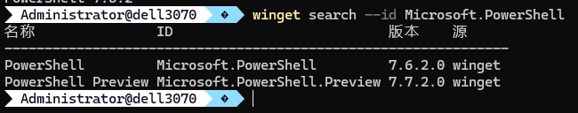
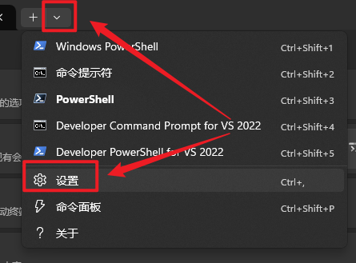
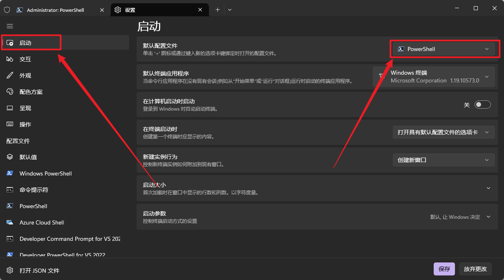
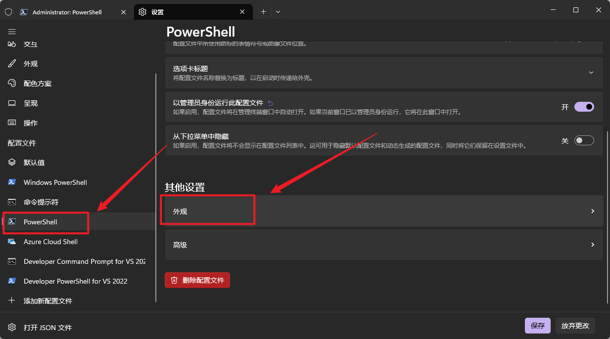
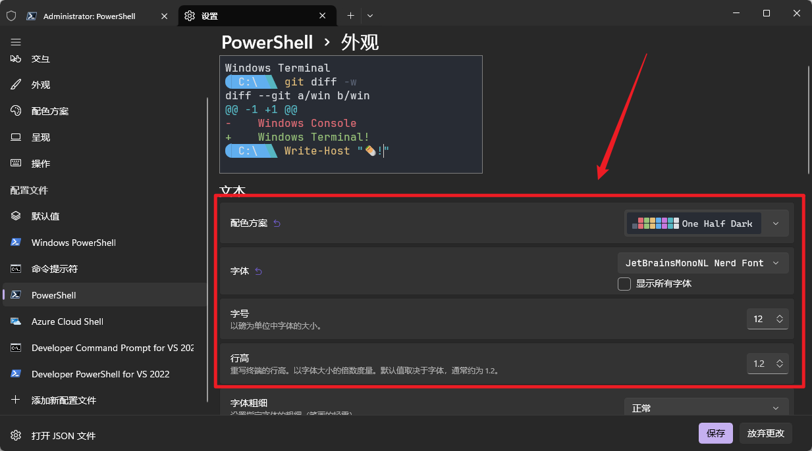

# PowerShell 7 安装


### 1. 搜索并安装PowerShell 7

---

​	搜索 **PowerShell 7**

```
winget search --id Microsoft.PowerShell
```

​	预期显示如下：

<p align="center">
  
</p>


​	随后安装 **PowerShell 7**

```
winget install --id Microsoft.PowerShell --source winget
```


### 2. 安装终端

---

​	在下方链接分别下载 **terminal** 和 **Oh my posh**

```
https://apps.microsoft.com/detail/9n0dx20hk701?hl=en-us&gl=US
https://apps.microsoft.com/detail/xp8k0hkjfrxgck?hl=en-us&gl=US
```


### 3. 安装字体

---

​	访问下方链接安装 **Meslo LGM NF** 字体

```
https://github.com/ryanoasis/nerd-fonts/releases/download/v3.0.2/Meslo.zip
```


​	或访问下方链接获取更多字体，最好用 **nerd** 系列字体

```
https://www.nerdfonts.com/font-downloads
```


### 4. 配置

---

​	**win+r** 运行 **wt**，打开Teminal的设置：

<p align="center">
  
</p>


​	将 **PowerShell 7** 设置为默认项

<p align="center">
  
</p>


​	在 **PowerShell - 外观** 中设置字体和样式

<p align="center">
  
</p>

<p align="center">
  
</p>


​	创建 **PowerShell 7** 配置文件用于更改样式，终端输入来创建配置文件：

```
if (-not (Test-Path $PROFILE)) {
    New-Item -Path $PROFILE -Type File -Force
}
```

​	用记事本打开：

```
notepad $PROFILE
```

​	编辑文件：

```
oh-my-posh init pwsh --config "$env:POSH_THEMES_PATH/jandedobbeleer.omp.json" | Invoke-Expression
```

​	进入下方网页选择心仪样式，复制样式的名称，将上方配置文件中的 **jandedobbeleer** 字段替换

```
https://ohmyposh.dev/docs/themes
```

